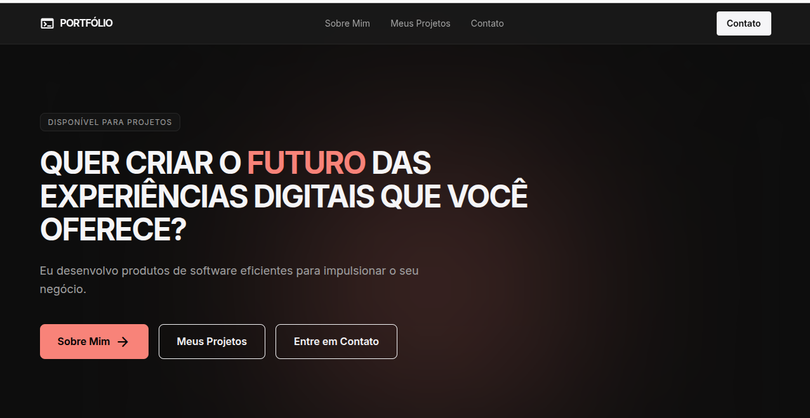
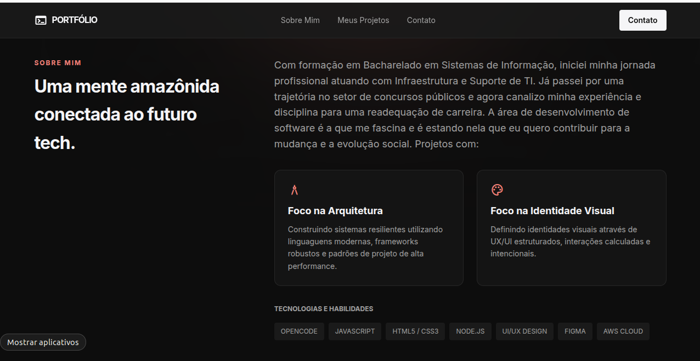
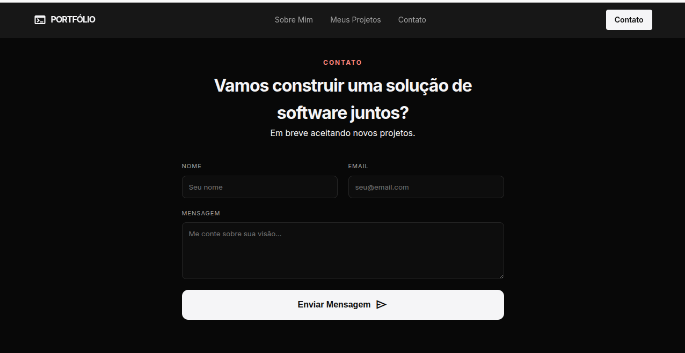

# ───  Wanuta Santos  ───
### `Software Developer | Systems Analyst`

<br />

> "Uma mente amazônida conectada ao futuro da tecnologia, construindo sistemas resilientes e experiências digitais intencionais."

<br />

## 📑 Sobre o Projeto
Este repositório armazena uma prévia do meu portfólio profissional atual, projetado e desenvolvido do absoluto zero. O objetivo principal deste projeto colocar em prática o estudo de HTML, CSS e JavaScript do primeiro ciclo do curso como aspirante na AlphaEdtech e seguir um passo a mais para consolidar minha readequação de carreira para o desenvolvimento de software, unindo a disciplina técnica da minha bagagem em Infraestrutura de TI e Sistemas de Informação à sensibilidade do design moderno.

O layout foi planejado seguindo uma estética minimalista *dark mode* de alto contraste, utilizando o **Rosa Coral** como tom de destaque para conferir sofisticação e personalidade à marca.

---

## 🔗 Aplicação em Produção
O portfólio já está publicado e otimizado para navegação:
✨ **[Acesse o Portfólio em Produção](https://portifolio-rouge-ten-77.vercel.app/)**

---

## 📌 Status do Projeto
* **Status:** `Concluído & Pronto para Entrega`
* **Versão:** `1.0.0`

---

## 🛠️ Tecnologias & Engenharia Web
Para assegurar o domínio completo dos fundamentos da Web e respeitar as diretrizes de desenvolvimento autoral (*hand-coded*), nenhuma biblioteca ou framework externo foi utilizado:

* **HTML5 Semântico:** Estruturação limpa, accessible e focada em SEO.
* **CSS3 Avançado:** Controle de layout via Flexbox e Grid, além de centralização de estilos através de variáveis nativas (`:root`).
* **JavaScript Puro (Vanilla JS):** Arquitetura de scripts limpa para manipulação de eventos e feedbacks do formulário.
* **Web APIs Nativas:** Implementação do `IntersectionObserver` para gerenciar as transações de animação e aparição fluida das seções à medida que o usuário interage com a tela.

---

## 🎨 Design & Prototipagem
Toda a experiência de interface (UI) e fluxo do usuário (UX) foram meticulosamente desenhados no Figma antes da escrita do primeiro bloco de código.
📐 **[Acesse o Protótipo no Figma](https://www.figma.com/design/bvDmjQAD2cFc7UkN8LvRuG/Portif%C3%B3lio?node-id=9-11&p=f&t=03bVoj1AunsrPcJb-0)**

---

## 📸 Demonstração Visual

Aqui estão os registros visuais do portfólio em funcionamento:

### 🖥️ Visão Geral (Desktop)


### 📱 Layout


### 📩 Seção de Contato


---

## ⚙️ Execução Local

Se desejar clonar o repositório e rodar o projeto localmente na sua máquina, execute os comandos abaixo no seu terminal:
1. **Clonar o repositório:**
```bash
   git clone git@github.com:Sant117/desafio-portifolio.git
1. **Clonar o repositório:**
```bash
   git clone git@github.com:Sant117/desafio-portifolio.git
